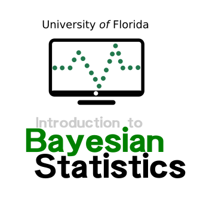

<p align="center">
  
</p>

## Instructors

- Dr. Guilherme Pereira, (**Course coordinator**)\
Federal University of Viçosa\

- Dr. Felipe Ferrão\
University of Florida\

## Course Description

This talk aims to be a friendly introduction to Bayesian analysis. Whenever we introduce new concepts, we keep the mathematics to a minimum and focus instead on the intuition behind the theory. For this class, we also do not assume any prior knowledge of probability (which is central to Bayesian analysis) or calculus. Nor do we advocate in favor of Bayesian analysis, instead of the frequentist school. The idea here is to provide an introduction on this topic and, hopefully, motivate students in genetics and plant breeding to use this tool for practical analyzes.

## Class notes and Hands-on

This is an attempt to organize and make available to any student the class notes used during this course. The material is a compilation of texts, examples, and materials from multiple books and papers that we visited to create the classes. We suggest using it as a guide for lessons. *Important: these class notes do not replace the fundamental role of the textbooks !!* At the end of each topic, there are references. We suggest that you visit the references for a complete understanding.

```
[pdf] = slides used in class
[html] = open it in your browser
[HW] = homework
[paper] = article suggested
[Download] = link for downloading the files. 
```

**1. Theory**
- Bayesian Data Analysis in a Nutshell [[pdf]](https://github.com/lfelipe-ferrao/lfelipe-ferrao.github.io/blob/master/class/Bayesian/Bayesian.pdf)

**2. Hands-on rstan**

- Introduction to Probabilistic Language (rstan) [[html]](https://htmlpreview.github.io/?https://github.com/lfelipe-ferrao/lfelipe-ferrao.github.io/blob/master/class/Bayesian/RegressionBayes.html)

**3. Hands-on BGLR**

- Use of Bayesian Statistics for genomic prediction (BGLR package)[[html]](https://htmlpreview.github.io/?https://github.com/lfelipe-ferrao/lfelipe-ferrao.github.io/blob/master/class/Bayesian/BGLR.html)

## References

### Books
- Gelman, A., Carlin, J. B., Stern, H. S., Dunson, D. B., Vehtari, A., & Rubin, D. B. (2013). Bayesian data analysis. CRC press.Link for the Book
- Kruschke, J. (2014). Doing Bayesian data analysis: A tutorial with R, JAGS, and Stan. Link for the book
- Lambert, B. (2018) A Student’s Guide to Bayesian Statistics. Link for the book
- McElreath, R. (2018). Statistical rethinking: A Bayesian course with examples in R and Stan. Chapman and Hall/CRC. Link for the book

### Papers
- Beaumont, M. A., & Rannala, B. (2004). The Bayesian revolution in genetics. Nature Reviews Genetics, 5(4), 251-261.
- Blasco, A. (2001). The Bayesian controversy in animal breeding. Journal of animal science, 79(8), 2023-2046.
- Kruschke, J. K., Aguinis, H., & Joo, H. (2012). The time has come: Bayesian methods for data analysis in the organizational sciences. Organizational Research Methods, 15(4), 722-752.
- Muth, C., Oravecz, Z., & Gabry, J. (2018). User-friendly Bayesian regression modeling: A tutorial with rstanarm and shinystan. Quantitative Methods for Psychology, 14(2), 99-119.
- Stephens, M., & Balding, D. J. (2009). Bayesian statistical methods for genetic association studies. Nature Reviews Genetics, 10(10), 681-690.

### Packages
- BGLR
- JAGS
- MCMCglmm
- Stan


