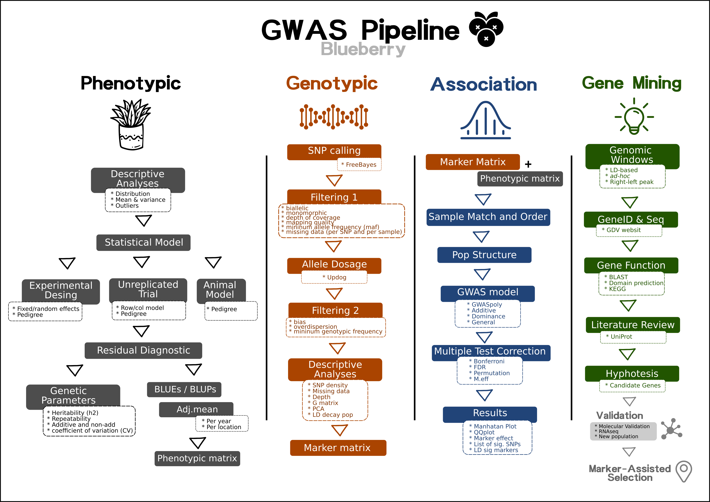

<p align="center">
  
</p>

## Instructors

- Dr. Felipe Ferrão\
University of Florida\

- Dr. Juliana Benevenuto\
University of Florida\

## Workshop Description

Current typical GWAS  measure hundreds of thousands, or millions, of genetic variants (typically Single Nucleotide Polymorphisms, or SNPs), in hundreds, thousands of individuals, with the primary goal being to identify which regions of the genome harbor SNPs that affect some phenotype or outcome of interest.

In recent years, the blueberry breeding program has focused its efforts on understanding the genetic architecture of complex traits associated with fruit quality. With multiple students working on different projects related to phenotype-genotype association analysis (via GWAS and QTL mapping), we decided to create this short practical tutorial to unify some of our routines and share experiences.

Some important points that deserve additional comments. The pipeline presented here is a "generic" pipeline. By "generic",  we mean that this is a starting point by just presenting general practices for performing GWAS analyses. Of course, each project has its particularity, with different experimental designs and specific data collection. All these aspects should be carefully thought out rather than running automated analyses. Simply stating, there is no magic recipe that works for all situations and that is why it is very important to check all the steps and make adaptations or test new methods whenever possible.

The second important aspect, we see any GWAS implementation as an integrated approach where it is necessary to add multiple expertises. That is, identifying associations per se is just a process of statistical genetics and technically does not mean that it is the end of the study. Our group has invested a lot of time to make sense of the identified associations, which makes a professional working in computational biology crucial in this regard. Finally, we invested resources in molecular biology aspects to validate our findings. With that in mind, we strongly believe that it is the interplay between **statistical genetics** for detecting association, **computational biology** for making biological sense, and **molecular biology** for future validations that makes GWAS more relevant for practical application

Below, the workflow that will be addressed in the workshop. 

<p align="center">
  
</p>

## Class notes and Hands-on

This is an attempt to organize and make available to any student the class notes used during this course. The material is a compilation of texts, examples, and materials from multiple books and papers that we visited to create the classes. We suggest using it as a guide for lessons. *Important: these class notes do not replace the fundamental role of the textbooks !!* At the end of each topic, there are references. We suggest that you visit the references for a complete understanding.

```
[pdf] = slides used in class
[html] = open it in your browser
[HW] = homework
[paper] = article suggested
[Download] = link for downloading the files. 
```

