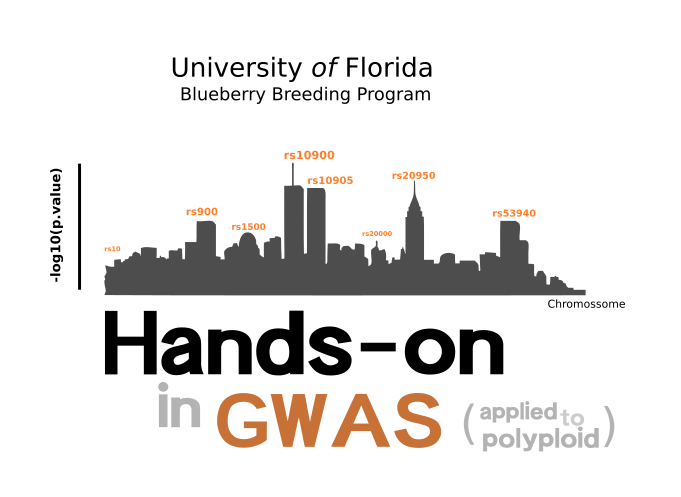

<p align="center">
  
</p>

## Instructors

- Dr. Felipe Ferrão\
University of Florida\

- Dr. Juliana Benevenuto\
University of Florida\

## Workshop Description

Current typical GWAS  measure hundreds of thousands, or millions, of genetic variants (typically Single Nucleotide Polymorphisms, or SNPs), in hundreds, thousands of individuals, with the primary goal being to identify which regions of the genome harbor SNPs that affect some phenotype or outcome of interest.

In recent years, the blueberry breeding program has focused its efforts on understanding the genetic architecture of complex traits associated with fruit quality. With multiple students working on different projects related to phenotype-genotype association analysis (via GWAS and QTL mapping), we decided to create this short practical tutorial to unify some of our routines and share experiences.


### Some comments 

- The pipeline presented here is a "generic" pipeline. By "generic", we mean that this should be viwed as a starting point in which we are presenting general practices for performing GWAS analyses. Of course, each project has its particularity -- different experimental designs, data collection, models and etc etc. All these aspects should be carefully thought when perfoming any statistical analyses. Running automated analyses by just recycling codes is not a good idea. Simply stating, there is no magic recipe that works for all situations and that is why it is very important to check all the steps and make adaptations or tests whenever necessary and possible. Be curious! Ask questions! Create hypotheses!

- The second important aspect. We see any practical GWAS implementation as an integrated approach where it is necessary to add multiple expertises. This is the way that the blueberry breeding program has approached GWAS analyses and using it for guide breeding decisions using marker-assisted selection. With that in mind, identifying associations per se is just a statistical genetics process and technically does not mean that it is the end of the study. Our group has focused on making sense of the identified associations. Therefore, professional (and students) working in computational biology are crucial in this regard. With increased computational power and multiple software available for GWAS analysis ,gene mining is indeed a phase that takes a lot of time and reflection. Finally, our practical framework involves molecular biology and its crucial role on validating the statistical findings. With that in said, we strongly believe that it is the interplay between **statistical genetics** for detecting association, **computational biology** for making biological sense, and **molecular biology** for future validations, that makes GWAS more relevant for practical application


### Workflow


<p align="center">
  
</p>

## Class notes and Hands-on

This is an attempt to organize and make available to any student the class notes used during this course. The material is a compilation of texts, examples, and materials from multiple books and papers that we visited to create the classes. We suggest using it as a guide for lessons. *Important: these class notes do not replace the fundamental role of the textbooks !!* At the end of each topic, there are references. We suggest that you visit the references for a complete understanding.

```
[pdf] = slides used in class
[html] = open it in your browser
[HW] = homework
[paper] = article suggested
[Download] = link for downloading the files. 
```

**1. Introduction to Phenotypic Analyses for GWAS studies** 

- Hands-on [[html]](https://htmlpreview.github.io/?https://github.com/lfelipe-ferrao/lfelipe-ferrao.github.io/blob/master/class/GWAS/1.Phenotypic.html)
- Download [[html]](https://minhaskamal.github.io/DownGit/#/home?url=https://github.com/lfelipe-ferrao/lfelipe-ferrao.github.io/blob/master/class/GWAS/1.Phenotypic.html)

- Theory: Introduction to mixed models
- Practice: `asreml-R` for analyses of phenotypic data, using blueberry as example

**2. Genotypic Analyses** 

- Hands-on [[html]](https://htmlpreview.github.io/?https://github.com/lfelipe-ferrao/lfelipe-ferrao.github.io/blob/master/class/GWAS/2.Genomics.html)
- Download [[html]](https://minhaskamal.github.io/DownGit/#/home?url=https://github.com/lfelipe-ferrao/lfelipe-ferrao.github.io/blob/master/class/GWAS/2.Genomics.html)

- Theory: Introduction to SNP calling and allele assignment
- Practice: `updog` R-package

**3. GWAS analyses** 

- Theory: Introduction to GWAS
- Practice: `GWASpoly` R-package

**4. Gene Mining** 


