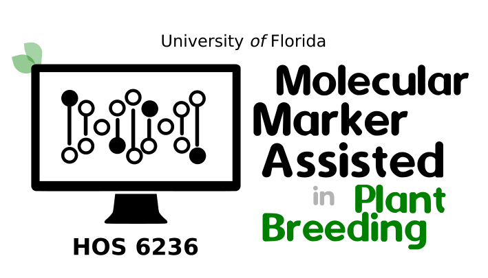

```{r setup, include=FALSE}
knitr::opts_chunk$set(echo = TRUE)
knitr::opts_chunk$set(warning = FALSE, message = FALSE)
```

---

:::fyi
**Objectives:**

- 60 minutes of hands-on 
- Introduction to Variant Discovery
- Simple example using the BCFtools
:::

:::demo

**Extra information**

- [HOS 6236 -- Website](https://lfelipe-ferrao.github.io/class/mas/)
- About the [author](https://lfelipe-ferrao.github.io/)
- About the [UF/IFAS Plant Breeding](https://programs.ifas.ufl.edu/plant-breeding/)

:::
---

# Introduction

This is a brief introduction to the field of genetic discovery, focusing on how genomic information is used to identify and analyze genetic variants. The topics covered in this class revolve around understanding molecular markers and how it is derived from raw sequencing data.

While there are several in-depth courses available at the University of Florida (UF) and numerous tutorials online that explain genotyping and how to access genotypic information, this class aims to provide a concise overview. The main objective is to introduce the types of genetic variants and, most importantly, to demonstrate the essential inputs and command-line tools required to process raw sequencing data and extract molecular marker information.

# What Is Genetic Variation?

Genetic variation refers to the differences in DNA sequences among individuals. Using human as an example, although the human genome contains approximately 3.1 billion base pairs, the DNA of any two individuals is about 99.5% to 99.8% identical. This small percentage of difference still translates to millions of base pair variations—about 4 million between any two people.

Despite seeming small, these genetic differences account for the wide phenotypic diversity (differences in traits like height, disease susceptibility, etc.). These variants are segregating within the population, meaning they are shared among different individuals. Genetic variation is crucial for studying genotype-phenotype relationships, as scientists are particularly interested in differences that impact traits or diseases—not the parts of DNA that are the same.

## Types of Genetic Variation

There are three main types of genetic variation in the human genome:

**Single Nucleotide Polymorphisms (SNPs or SNVs)**

- These are the most common type of variation.
- Involve a change in a single DNA base (e.g., a C instead of a T).
- Occur roughly every 600–750 base pairs between two people.
- Also called point mutations, variants, or polymorphisms—terms often used interchangeably.

**Insertions and Deletions (Indels)**

- Small segments of DNA (a few base pairs) that are either inserted or deleted.
- Whether it’s called an insertion or deletion depends on the reference point.
- Example: One person has a "TG" segment, while another does not.

**Structural Variants**

- Larger changes involving thousands to millions of base pairs.
- Can include large insertions, deletions, duplications, or inversions.
- Once thought to be rare outside of cancer genomes, these are now known to be common in healthy individuals—with each person carrying around 5,000–10,000 of them.


**Global Genomic Diversity: The 1000 Genomes Project**

Let's use an example in human. This project sequenced 2,504 individuals from diverse global populations. It aimed to catalog common genetic variations across humanity.So far, results showed that a typical genome differs from the reference genome at 4–5 million sites, mostly due to SNPs and Indels. In humans, there were identified 2,000–2,500 large structural variants per person—now believed to be a low estimate due to older sequencing tech.

# How to measure genetic variation ? 


Single Nucleotide Polymorphism (SNP) calling is the process of identifying single-base variations in DNA sequences across individuals. This is an essential step in genomic research and breeding programs. Below is an overview of the SNP calling workflow, followed by a practical example using **BCFtools**, a widely used command-line tool for variant calling.

## SNP Calling Steps

1. **Sequencing**  
   Genomic DNA is sequenced using platforms like Illumina, producing raw reads in FASTQ format.

2. **Read Alignment**  
   These reads are aligned to a reference genome using alignment tools (e.g., BWA), producing BAM files.

3. **Pre-processing**  
   The BAM files are sorted, duplicates are marked, and quality scores may be recalibrated.

4. **Variant Calling**  
   Tools like **BCFtools** are used to detect SNPs and small indels. The output is a VCF file containing the variant positions and genotype information.

5. **Filtering and Annotation**  
   Variants are filtered based on quality and depth, and then annotated for functional effect using tools like SnpEff or ANNOVAR.

# Hands-on

In the example below, we created a simplified pipeline to demonstrate how to perform basic SNP calling in **blueberry** using a subset of real data. For the sake of computational efficiency and clarity, we limited the dataset to **50 blueberry samples** and focused exclusively on **chromosome 1**. Since this study is based on capture sequencing, which targets specific genomic regions, we included a short list of target regions (provided in BED format) to restrict SNP calling only to relevant loci.

The primary goal of this demonstration is to show that SNP calling is a straightforward process that can be completed with a manageable number of bioinformatics steps using your own computer. In this example, we used BCFtools, a fast and efficient tool for variant calling. However, it's important to note that other software tools such as FreeBayes and GATK HaplotypeCaller are also widely used and follow different statistical models and algorithms. Despite differences in methodology, these tools generally produce comparable results, especially when applied to high-quality, well-prepared datasets.

Ultimately, our aim is to generate VCF (Variant Call Format) files, which summarize the positions and genotypes of identified SNPs across all samples. These VCF files are critical outputs of the SNP calling process and will serve as the input for downstream analyses, such as population structure, genome-wide association studies (GWAS), or genotype-phenotype correlation studies.

## Blueberry example using the BCFtools pipeline

**Pre-requisites**

- Aligned reads in BAM format (sorted and indexed)
- A reference genome in FASTA format (with index: .fai)
- BCFtools installed
- (Optional) A BED file with target regions (for targeted sequencing like capture-seq)

**Generate Genotype Likelihoods with `bcftools mpileup`**

This command summarizes the base calls at each genomic position, calculates genotype likelihoods, and adds annotations like depth (DP) and allele depth (AD). In the example below, it will:

- Reading 50 BAM files
- Using a reference genome (subgenome_blue.fasta, in blueberry)
- Focusing only on 10K probe regions defined in the BED file (target capture regions)
- Filtering out low-quality reads (minimum mapping quality 20)
- Generating a VCF with genotype likelihoods and depth info for each position

```{bash,eval=F}
bcftools mpileup --output-type u \
    --bam-list list_of_50_bam_files_VaccDscaff1.txt \
    --annotate FORMAT/AD,FORMAT/DP \
    --targets-file probes10K_DraperGenome_VaccDscaff1.bed \
    --min-MQ 20 \
    --fasta-ref subgenome_blue.fasta \
    --output bcftools_mpileup.vcf
```

**Variant Calling using the `bcftools call`** 

The next command is performing variant calling—converting the genotype likelihoods generated by `bcftools mpileup` into actual variant calls (SNPs and indels) and writing them to a VCF file.In the blueberry example, it will:

- Reads the genotype likelihoods at each site from bcftools_mpileup.vcf
- Calculates the most likely genotype for each sample at each site
- Determines if that site is a variant (i.e. differs from the reference)
- If it is, includes it in the final VCF (bcftools_mpileup_call.vcf)
- Ignores all invariant positions due to --variants-only

```{bash,eval=F}
bcftools call --output-type u \
        --multiallelic-caller \
        --variants-only \
        --output bcftools_mpileup_call.vcf \
        bcftools_mpileup.vcf
```

**Output**

Since this is a toy example using only 50 samples and a subset of the genome (chromosome 1), the entire SNP calling process should complete in approximately 5 minutes on a standard workstation. For simplicity, we assume that blueberry is diploid, although in reality, blueberry is a polyploid species. In a real-world analysis, we could use the variant calling output to infer allele dosages more accurately by incorporating ploidy-aware tools or methods.

The main output of this process is a VCF (Variant Call Format) file, which contains the list of detected variants, their genomic positions, reference and alternate alleles, and genotype information for each sample. This file serves as the foundation for downstream analyses such as filtering, annotation, GWAS, or population structure analysis.

Below, there is an example of VCF file.


# Conclusion

Bioinformatic pipelines play a central role in variant discovery, enabling researchers to process raw sequencing data into high-confidence genetic variants such as SNPs (Single Nucleotide Polymorphisms) and small indels. These pipelines typically include steps like quality control, read alignment, and variant calling, followed by filtering and annotation.

Among the most widely used tools for SNP and variant calling are:

- **GATK (Genome Analysis Toolkit)**  
  A robust and widely adopted toolkit developed by the Broad Institute, offering best-practice workflows for variant discovery in high-throughput sequencing data. It includes advanced features like base quality score recalibration, haplotype-based calling, and joint genotyping.  
Link:  [https://gatk.broadinstitute.org](https://gatk.broadinstitute.org)

- **FreeBayes**  
  A Bayesian genetic variant detector that works well with population-level data and can detect polymorphisms across multiple samples simultaneously. It is useful for calling variants in non-model organisms and mixed ploidy datasets.  
Link: [https://github.com/freebayes/freebayes](https://github.com/freebayes/freebayes)

- **SAMtools / BCFtools**  
  A lightweight and efficient pipeline for variant calling directly from aligned reads (BAM files). Though simpler than GATK, it remains a popular and effective tool for small to medium-sized projects.  
Link: [http://www.htslib.org](http://www.htslib.org)

Each of these tools can be integrated into customized or standardized variant discovery pipelines depending on project needs, computational resources, and organism complexity. Mastery of these pipelines is essential for transforming raw sequencing data into reliable genetic markers, setting the stage for downstream analyses in genomics, evolutionary biology, and precision breeding.


---

----
<p align="center">
  
</p>
----

