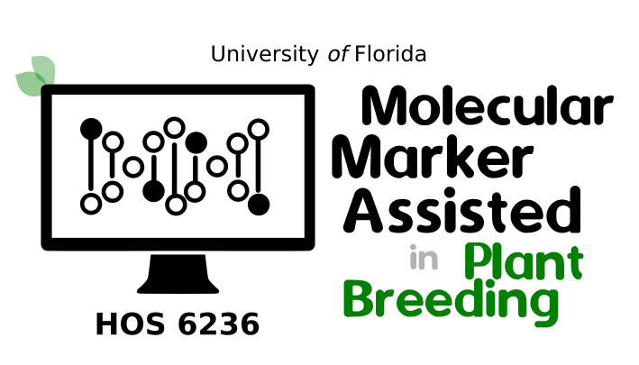

<p align="center">
  
</p>


## Instructors

- Dr. Marcio Resende, (**Course coordinator**)\
2135 Fifield Hall\
mresende@ufl.edu\
Office Hours by appointment

- Dr. Felipe Ferrão\
Paul Lyrene Blueberry Research Building \
lferrao@ufl.edu\
Office Hours by appointment

## Course Description

This course provides theory, methods and procedures required to apply molecular information in plant breeding programs. The course will be based on lectures and multiple hands-on activities that apply what is learned. Frequent evaluations will occur during the semester by topic (see below). Students are required to attend classes physically.

## Course Objectives
The course goal is to familiarize students with the application of molecular information to plant breeding. By the end of the semester students should be able to describe current methods for mapping quantitative trait loci (QTL), Genome-wide association (GWAS), marker-assisted selection (MAS), and Genomic Selection (GS). The course will also review the applications of biotechnology to breeding programs. Students should be able to describe the advantages and disadvantages of the different methods covered in the course. Students should also be able to list the biotechnology methods applied to plant breeding. Ultimately, students should be able to identify what method and what strategy should be applied depending on the species, the breeding goals, the population and the timeframe.


## Required and Recommended Literature

- Isik, F., Holland, J., Maltecca, C. - Genetic Data Analysis for Plant and Animal Breeding. (2017).
DOI: 10.1007/978-3-319-55177-7
- Introduction to Quantitative Genetics, Falconer and Mackay, Longman Group Ltd, 1996
- Genetics and analysis of quantitative traits, Lynch and Walsh, Sinauer, 1998

## Software

**You will need to bring your laptop.** The main software used will be R with a library for ASReml-R. R
can be downloaded from www.r-project.org.

# Class notes and Hands-on

It is an attempt to organize and make available to any student the class notes used during this course. The material is a compilation of texts, examples, and materials from multiple books and papers that we visited to create the classes. We suggest using it as a guide for lessons. *Important: these class notes do not replace the fundamental role of the textbooks !!* At the end of each topic, there are references. We suggest that you visit the references for a complete understanding. Finally, we hope in the future include more authorial examples using data from our personal research.

```
[pdf] = slides used in class
[html] = open it in your browser
[HW] = homework
[paper] = article suggested
[Download] = link for downloading the files. 
```

**1. Introduction to Molecular Markers**

- Hands-on [[html]](https://htmlpreview.github.io/?https://github.com/lfelipe-ferrao/lfelipe-ferrao.github.io/blob/master/class/mas/week0_mas.html)
- Download [[html]](https://minhaskamal.github.io/DownGit/#/home?url=https://github.com/lfelipe-ferrao/lfelipe-ferrao.github.io/blob/master/class/mas/week0_mas.html)

- Theory: Introduction to molecular markers
- Practice: Simple SNP Calling tutorial using the BCFtools 

