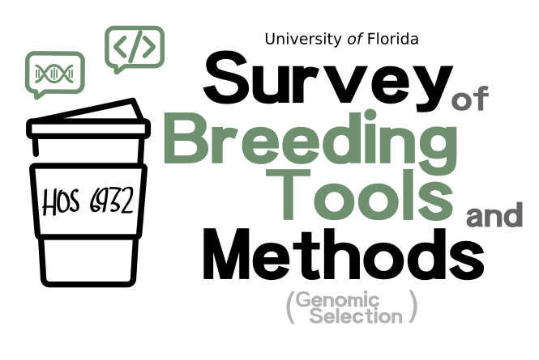

<p align="center">
  
</p>

*Let's grab some coffee and discuss methods and techniques used in plant breeding!!* 

## Instructors

- Dr.Patricio Munoz, (**Course coordinator**)\
University of Florida

- Dr. Felipe Ferrão, (**Course coordinator**)\
University of Florida

## Course Description

During our lunch time (Tuesday 11:45-12:35pm and Thursday 11:45-1:40 pm) we will discuss some vibrant topics underlying the routine of modern breeding programs. Survey of Breeding Tools and Methods (HOS 6932) is an introductory class at the [UF/IFA Plant Breeding](https://programs.ifas.ufl.edu/plant-breeding/graduate-program/) graduate course. The intent of the course is to help students understand the breadth of disciplines in the vibrant field of plant breeding. The course will be taught by experts using these techniques and methods in their plant breeding. I am the instructor of the **Quantitative Genetics and Genomic Selection** module.  

# Recommended Literature

**Quantitative Genetics**

- Bernardo, 2010. Breeding for Quantitative Traits in Plant Breeding. [Book link](http://stemmapress.com/)
- Falconer and Mackay, 1996. Introduction to Quantitative Genetics.
[Book link](https://www.amazon.com/Introduction-Quantitative-Genetics-Douglas-Falconer/dp/0582243025)
- Cruz, 2005. Princípios de Genética Quantitativa. [Book link](https://www.editoraufv.com.br/produto/principios-de-genetica-quantitativa/1109015)
- Lynch and Walsh, 1998. Genetics and Analysis of Quantative Traits. [Book link](https://www.amazon.com/Genetics-Analysis-Quantitative-Traits-Michael/dp/0878934812)

**Statistical Learning**

- James et al.,2020. An introduction to Statistical Learning. [Book link](https://www.statlearning.com/) 

**Genomic Selection**

- Mrode, 2014. Linear Models for the Prediction of Animal Breeding Values. [Book link](https://www.amazon.com/Linear-Models-Prediction-Animal-Breeding/dp/1845939816)
- Isik et al., 2017. Genetic Data Analysis for Plant and Animal Breeding. [Book link](https://www.springer.com/gp/book/9783319551753)

# Class notes and Hands-on

It is an attempt to organize and make available to any student the class notes used during the Quantitative Genetic course. The material is a compilation of texts, examples, and materials from multiple books and papers that we visited to create the classes. We suggest using it as a guide for lessons. *Important: these class notes do not replace the fundamental role of the textbooks !!* At the end of each topic, there are references. We suggest that you visit the references for a complete understanding. Finally, we hope in the future include more authorial examples using data from our personal research.


```
[pdf] = slides used in class
[html] = open it in your browser
[HW] = homework
[paper] = article suggested
[Download] = link for downloading the files. 
```
**1. Introduction to Quantitative Genetics** 

- Class 1[[pdf]](https://github.com/lfelipe-ferrao/lfelipe-ferrao.github.io/blob/master/class/survey/Class1_Introduction.pdf)
- Hands-on [[html]](https://htmlpreview.github.io/?https://github.com/lfelipe-ferrao/lfelipe-ferrao.github.io/blob/master/class/survey/1.Introduction.html)
- Download [[html]](https://minhaskamal.github.io/DownGit/#/home?url=https://github.com/lfelipe-ferrao/lfelipe-ferrao.github.io/blob/master/class/survey/1.Introduction.html)

- Theory:Introduction to Quantitative Genetics
- Practice: Shinny app

**2.Statistical Learning and Whole-Genome Regression Models**

- Class 2[[pdf]](https://github.com/lfelipe-ferrao/lfelipe-ferrao.github.io/blob/master/class/survey/Class2_LinearModelRegularization%20.pdf)

- Theory: Introduction to Statistical Learning, rrBLUP and GBLUP 

