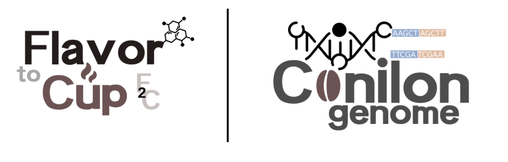
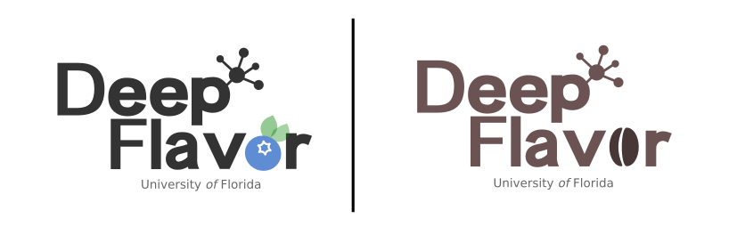

{: .image-pull-right}  My name is **Luis Felipe Ventorim Ferrão** and I'm a **Research Assistant Scientist** at the University of Florida, working in collaboration with Dr. Patricio Munoz at the [Blueberry Breeding and Genomics Lab](https://www.blueberrybreeding.com/). You can read more about my work on this webpage and also see codes, papers, class notes and talks associated with my research.

## Specific areas

- Association Mapping (GWAS)
- Genomic Prediction
- Linkage and QTL mapping
- Bayesian Inference
- Metabolomics and Sensory Analysis
- Blueberry Breeding
- Coffee Breeding

## Blueberry Research Topics

  

## Coffee Research Topics

### Motivation

Coffee is an widely-consumed beverage that drives a vibrant industry.  Despite this importance, its sustainability is facing critical challenges including price volatility, limited access to genetic resources, the presence of new diseases and, in particular, accelerated climate changes. Genomic research in coffee could unveil crucial insights into the plant’s biological characteristics, including disease resistance, yield potential, and quality attributes. Some important projects lead by the University of Florida

### Flavor to Cup (F2C)

  

- Objective: investigate new genomic tools that could be used to developing a new generation of climate-smart coffee cultivars that combine flavor and are more resilient to the projected climate changes.
- Goals: 
  + Assembly a high-quality _C. canephora_ reference genome
  + Dissect the genetic architecture of flavor-related traits
  + Combine sensory, metabolomics and genomics into a single framework for molecular breeding
- Collaborators: 
  + Incaper (Brazil)
  + Denise Tieman (University of Florida)
  + Patricio Munoz (University of Florida)
  + Marcio Resende Jr. (University of Florida)
  + Christophe Montagon (RD2 vision)

### Breeding for Climate-Smart Coffee Cultivars

  

- Objective: create an innovative and vibrant research line focused on coffee production and research.
- Goals:
  + Where we should primarily grow coffee in the Florida State?
- Funding: Support for Emerging Enterprise Development Integration Teams (SEEDIT)
- Collaborators: 
  + William Hammond (University of Florida)
  + Lorenzo Rossi (University of Florida)
  + Guilherme Locatelli (University of Florida)
  + Ali Sarkhosh (University of Florida)
  + Jonathan Crane (University of Florida)
  + Werner Collante (University of Florida)
  + Patricio Munoz (University of Florida)
  + Marcio Resende Jr. (University of Florida)
 
### Deep Flavor

  

- Objective: leveraging flavor analyses by using Artificial Intelligence methods
- Goals:
  + Can we have a better understanding of consumer preferences by combining traditional sensory panel evaluations and computer vision?
  + From a statistical standpoint, how are the main chemical components acting (and interacting) to create flavor preferences?
- Funding: Launching Innovative Faculty Teams in AI (LIFT AI)
- Collaborators: 
  + Raquel Dias (University of Florida)
  + Denise Tieman (University of Florida)
  + Charles A. Sims (University of Florida)
  + Marcio Resende Jr. (University of Florida)
  +  Patricio Munoz (University of Florida)

### External Links
- [UF-IFAS](https://hos.ifas.ufl.edu/people/on-campus-faculty/)
- [Blueberry Breeding Program](https://www.blueberrybreeding.com/)

